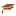

<!doctype html>
<html lang="en">
    <head>
        <meta charset="utf-8">
        <meta http-equiv="X-UA-Compatible" content="IE=edge">
        <meta name="viewport" content="initial-scale=1,user-scalable=no,maximum-scale=1,width=device-width">
        <meta name="mobile-web-app-capable" content="yes">
        <meta name="apple-mobile-web-app-capable" content="yes">
        <link rel="stylesheet" href="css/leaflet.css"><link rel="stylesheet" href="css/L.Control.Locate.min.css">
        <link rel="stylesheet" href="css/qgis2web.css"><link rel="stylesheet" href="css/fontawesome-all.min.css">
        <link rel="stylesheet" href="css/leaflet-search.css">
        <link rel="stylesheet" href="css/leaflet-control-geocoder.Geocoder.css">
        <link rel="stylesheet" href="css/leaflet-measure.css">
        
        <title></title>
    </head>
    <body>
        

        

        
        
        
        
        
        
        
        
        
        
        
        
        
        
        
        
        
        
        
        
        
        
        
        
        
        
        
        
        
        
    </body>
</html>
